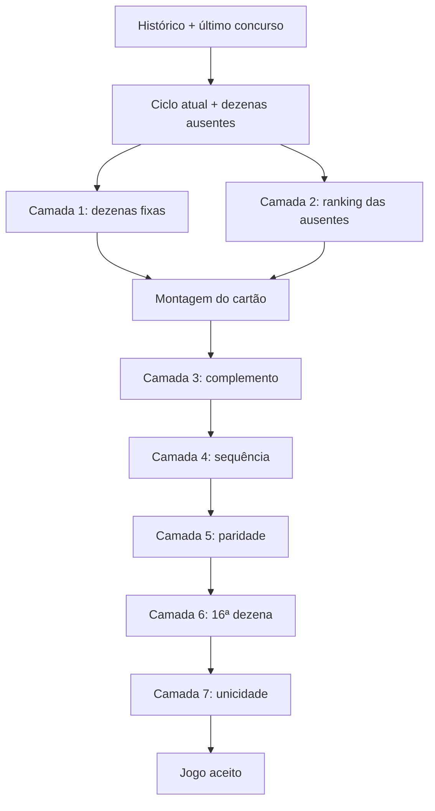

# Relatório da Arquitetura Integrada do Gerador de Jogos da Lotofácil

## Visão geral

O gerador de jogos foi estruturado em camadas, onde cada etapa coleta dados do histórico, do ciclo atual e do último concurso para construir um cartão final validado.

A lógica principal está concentrada na função `gerarJogos`, em `src/pages/meus-jogos.jsx`, e segue uma sequência de análise, seleção, validação e unicidade.

---

## Fluxo geral

---

## Camada 1 — Dezenas fixas do contexto atual

### Objetivo

Gerar a base mais forte do cartão, escolhendo dezenas com maior força estatística.

### Entrada

- Histórico completo de resultados
- Último concurso sorteado
- Ranking estatístico por dezena

### Processo

- `getRankingDezenas(resultados)` calcula a probabilidade de repetição com base no histórico anterior
- `calcularPercentualDezenasPorPosicao(...)` verifica como as dezenas se comportam na posição atual do ciclo
- `calcularProbabilidadeCondicional(...)` mede a chance de a dezena continuar ausente ou reaparecer
- `calcularRankingEstatistico(...)` calcula o score final
- O sistema seleciona as dezenas do último concurso que possuem melhor score

### Resultado

`dezenasFixas9`

### Função na arquitetura

Essa camada cria a base inicial do cartão, funcionando como o “núcleo forte” do jogo.

---

## Camada 2 — Dezenas ausentes do ciclo atual

### Objetivo

Priorizar as dezenas que ainda não saíram no ciclo atual, usando o comportamento histórico da posição em que o ciclo se encontra.

### Entrada

- ciclo atual
- dezenas ainda ausentes
- histórico de todos os ciclos
- frequência por posição
- percentual de ausência por posição
- probabilidade condicional

### Processo

A função `calcularRankingAusentesPorPosicao(...)` calcula para cada dezena:

- frequência histórica
- percentual de ausência na posição atual
- média
- mediana
- moda
- probabilidade condicional
- score final

A fórmula atual considera:

- percentual × 0,45
- condicional × 0,35
- média × 1,5
- mediana × 1,2
- moda × 1,2

### Resultado

`rankingAusentes` filtrado para as dezenas ainda ausentes do ciclo atual.

### Integração

- O ranking das ausentes vira a prioridade da seleção do núcleo do jogo
- `getDynamicSelectionCount(...)` define quantas ausentes entram no jogo
- a regra de 50% a 60% do total de ausentes é mantida para controlar intensidade

### Função na arquitetura

Essa camada é a principal decisão estratégica do gerador, porque conecta o estado atual do ciclo com o histórico daquele ponto do jogo.

---

## Camada 3 — Complemento do cartão

### Objetivo

Completar o cartão até 15 dezenas, sem perder consistência, equilíbrio e lógica histórica.

### Entrada

- `rankingCompleto` gerado pelo histórico geral
- dezenas fora do último concurso
- lista de dezenas já escolhidas no cartão

### Processo

- `dezenasForaDoConcursoAtual` elimina os números que saíram no último sorteio
- `poolComplemento` reúne as dezenas com melhor força histórica
- `selecionarDistribuido(...)` seleciona os números mais adequados, respeitando:
    - ausência do cartão atual
    - menor uso recente
    - ordem do ranking
    - aleatoriedade controlada

### Resultado

Completação do cartão até 15 dezenas.

### Função na arquitetura

A camada 3 fecha o grupo principal do jogo sem depender só da sorte, mantendo a base robusta da camada 1 e 2.

---

## Camada 4 — Limite de sequências consecutivas

### Objetivo

Evitar cartões com excesso de números em sequência.

### Processo

- `encontrarMaiorSequenciaConsecutiva(numeros)` verifica a maior sequência consecutiva
- `validarSequenciasConsecutivas(cartao, 4)` rejeita qualquer cartão com sequência acima do limite

### Resultado

Cartões com sequências muito lineares são descartados.

### Função na arquitetura

Essa camada funciona como filtro de qualidade para evitar padrões muito previsíveis.

---

## Camada 5 — Paridade obrigatória

### Objetivo

Manter um equilíbrio sazonado entre pares e ímpares.

### Processo

- conta quantos números são pares e ímpares
- aceita apenas:
    - 7 pares / 8 ímpares
    - 8 pares / 7 ímpares

### Resultado

O cartão deixa de ser muito tendencioso para um tipo de número.

### Função na arquitetura

Esta camada regula a distribuição interna do jogo, equilibrando o perfil do cartão.

---

## Camada 6 — 16ª dezena adicional

### Objetivo

Criar o jogo completo de 16 dezenas (15 do cartão + 1 adicional).

### Processo

`selecionarDezenaAdicional(...)` faz:

1. tentar escolher uma dezena ausente do ciclo atual
2. se não houver, escolhe aleatoriamente entre as dezenas fora do cartão

### Resultado

Um jogo completo de 16 números, pronto para a validação final.

### Função na arquitetura

Essa camada reforça o contexto do ciclo atual e mantém a lógica estatística viva mesmo no fechamento do jogo.

---

## Camada 7 — Unicidade

### Objetivo

Garantir que o jogo gerado não exista no histórico nem tenha sido gerado antes.

### Processo

`verificarJogoUnico(...)`:

- monta todas as combinações de 15 números possíveis dentro do jogo de 16
- rejeita se alguma combinação já foi sorteada
- rejeita se alguma combinação já foi criada antes em outros jogos gerados

### Resultado

O jogo só entra na lista final se for realmente novo.

### Função na arquitetura

É a última barreira de segurança. As camadas anteriores criam candidatos bons; esta camada valida se eles são realmente utilizáveis.

---

## Sequência real de geração

1. Carrega histórico e último concurso
2. Analisa ciclos e posição atual
3. Calcula ranking do ciclo e das ausentes
4. Monta `dezenasFixas9`
5. Seleciona `quantidadeAusentes` com base em `getDynamicSelectionCount(...)`
6. Escolhe as ausentes mais fortes com `selecionarAusentesUnicos(...)`
7. Completa o cartão com `poolComplemento`
8. Valida sequência
9. Valida paridade
10. Seleciona a 16ª dezena
11. Verifica unicidade
12. Aceita o jogo e repete até gerar 15 jogos, ou até esgotar tentativas

---

## Resumo da arquitetura

A arquitetura do gerador ficou organizada da seguinte forma:

- Camada 1: força histórica
- Camada 2: estado do ciclo atual
- Camada 3: complemento inteligente
- Camada 4: qualidade do padrão
- Camada 5: equilíbrio estatístico
- Camada 6: fechamento do jogo
- Camada 7: exclusividade final

Em outras palavras, o gerador não trabalha com sorte pura; ele combina:

- histórico
- ciclo atual
- comportamento individual das dezenas
- validação matemática
- unicidade

Isso transforma o processo em uma estrutura de geração guiada por dados, com filtros e regras em sequência.

---

## Observação final

O arquivo principal do gerador está em [src/pages/meus-jogos.jsx](src/pages/meus-jogos.jsx), e esta documentação foi criada para facilitar a leitura da lógica e a manutenção futura do algoritmo.
